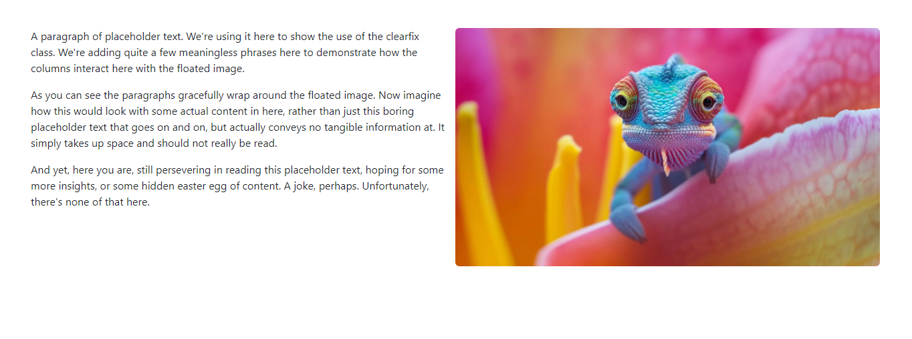

# Style
```
<style>
    div.col {
        height: 50px;
        width: 100px;
        background-color: red;
        margin: 5px;
        border-radius: 5px;
        text-align: center;
        line-height: 50px;
        color: white;
    }
</style>
```

# Container
```
<div class="container text-center">
    <div class="row">
        <div class="col">Column</div>
        <div class="col">Column</div>
        <div class="col">Column</div>
        <div class="col">Column</div>
        <div class="col">Column</div>
        <div class="col">Column</div>
        <div class="col">Column</div>
        <div class="col">Column</div>
        <div class="col">Column</div>
        <div class="col">Column</div>
    </div>
</div>
```

---

# container sizes
```
<div class="container text-center">
    <div class="row">
        <div class="col">Column</div>
        <div class="col-xs-6">Column</div>
        <div class="col">Column</div>
    </div>
</div>
```


`<div class="col-sm-8">Column</div>`


---

# Row cols
```
<div class="container text-center">
    <div class="row row-cols-4">
        <div class="col">Column</div>
        <div class="col">Column</div>
        <div class="col">Column</div>
        <div class="col">Column</div>
        <div class="col">Column</div>
        <div class="col">Column</div>
        <div class="col">Column</div>
        <div class="col">Column</div>
        <div class="col">Column</div>
        <div class="col">Column</div>
        <div class="col">Column</div>
        <div class="col">Column</div>
        <div class="col">Column</div>
        <div class="col">Column</div>
    </div>
</div>
```

---

# Justify-content-center
```
<div class="row row-cols-auto justify-content-center">
    <div class="col">Column</div>
    <div class="col">Column</div>
    <div class="col">Column</div>
    <div class="col">Column</div>
</div>
```

---

```
<div class="container text-center">
    <div class="row row-cols-1 row-cols-sm-2 row-cols-md-4">
        <div class="col">Column</div>
        <div class="col">Column</div>
        <div class="col">Column</div>
        <div class="col">Column</div>
    </div>
</div>
```


---

# Website
```
<div class="clearfix m-5">
    

    <p>
        A paragraph of placeholder text. We're using it here to show the use of the clearfix class. We're adding
        quite a few meaningless phrases here to demonstrate how the columns interact here with the floated
        image.
    </p>

    <p>
        As you can see the paragraphs gracefully wrap around the floated image. Now imagine how this would look
        with some actual content in here, rather than just this boring placeholder text that goes on and on, but
        actually conveys no tangible information at. It simply takes up space and should not really be read.
    </p>

    <p>
        And yet, here you are, still persevering in reading this placeholder text, hoping for some more
        insights, or some hidden easter egg of content. A joke, perhaps. Unfortunately, there's none of that
        here.
    </p>
</div>
```

---